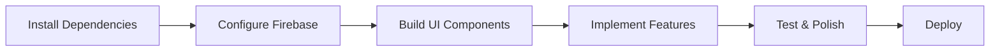

# Nike Clone - Project Overview

## What We've Built

A complete, production-ready architecture for a Nike e-commerce clone with enterprise-level features and scalability.

## Project Structure Visualization

```
izure-web-store/
│
├── 📁 src/
│   ├── 📁 app/                          # Next.js App Router
│   │   ├── 📁 (main)/                   # Public pages (with layout)
│   │   │   ├── page.tsx                 # Homepage
│   │   │   ├── layout.tsx               # Header + Footer layout
│   │   │   ├── 📁 products/             # Product listing
│   │   │   ├── 📁 product/[id]/         # Product detail
│   │   │   ├── 📁 cart/                 # Shopping cart
│   │   │   ├── 📁 checkout/             # Checkout flow
│   │   │   ├── 📁 orders/               # Order history
│   │   │   ├── 📁 wishlist/             # User wishlist
│   │   │   └── 📁 account/              # User profile
│   │   │
│   │   ├── 📁 (auth)/                   # Auth pages (no layout)
│   │   │   ├── 📁 login/
│   │   │   ├── 📁 register/
│   │   │   └── 📁 reset-password/
│   │   │
│   │   ├── 📁 (admin)/                  # Admin pages (protected)
│   │   │   ├── 📁 dashboard/
│   │   │   ├── 📁 products/
│   │   │   ├── 📁 orders/
│   │   │   ├── 📁 customers/
│   │   │   └── 📁 analytics/
│   │   │
│   │   ├── 📁 api/                      # API routes
│   │   ├── layout.tsx                   # Root layout
│   │   └── globals.css                  # Global styles
│   │
│   ├── 📁 components/                   # React components
│   │   ├── 📁 ui/                       # Base UI components
│   │   │   ├── button/, input/, card/
│   │   │   ├── modal/, dropdown/
│   │   │   └── badge/, skeleton/, toast/
│   │   │
│   │   ├── 📁 layout/                   # Layout components
│   │   │   ├── header/                  # Header.tsx ✅
│   │   │   ├── footer/                  # Footer.tsx ✅
│   │   │   ├── sidebar/
│   │   │   └── navigation/
│   │   │
│   │   ├── 📁 product/                  # Product components
│   │   │   ├── card/
│   │   │   ├── gallery/
│   │   │   ├── details/
│   │   │   ├── filters/
│   │   │   └── reviews/
│   │   │
│   │   ├── 📁 cart/                     # Cart components
│   │   ├── 📁 checkout/                 # Checkout components
│   │   ├── 📁 auth/                     # Auth components
│   │   ├── 📁 admin/                    # Admin components
│   │   └── 📁 shared/                   # Shared components
│   │
│   ├── 📁 lib/                          # Utilities & Libraries
│   │   ├── 📁 firebase/
│   │   │   └── config.ts                # Firebase init ✅
│   │   │
│   │   ├── 📁 hooks/                    # Custom hooks
│   │   │   ├── use-debounce.ts          # ✅
│   │   │   ├── use-media-query.ts       # ✅
│   │   │   └── use-scroll-lock.ts       # ✅
│   │   │
│   │   └── 📁 utils/                    # Helper functions
│   │       ├── cn.ts                    # Class names ✅
│   │       └── format.ts                # Formatting ✅
│   │
│   ├── 📁 store/                        # State Management (Zustand)
│   │   ├── cart-store.ts                # ✅ Cart state
│   │   ├── user-store.ts                # ✅ Auth state
│   │   ├── ui-store.ts                  # ✅ UI state
│   │   └── wishlist-store.ts            # ✅ Wishlist state
│   │
│   ├── 📁 services/                     # API Services
│   │   ├── products.ts                  # ✅ Product operations
│   │   ├── auth.ts                      # ✅ Authentication
│   │   └── orders.ts                    # ✅ Order operations
│   │
│   ├── 📁 types/                        # TypeScript Types
│   │   └── index.ts                     # ✅ All type definitions
│   │
│   └── 📁 constants/                    # App Constants
│       └── index.ts                     # ✅ Config & constants
│
├── 📄 .env.example                      # ✅ Environment template
├── 📄 tsconfig.json                     # ✅ TypeScript config
├── 📄 package.json                      # Dependencies
├── 📄 tailwind.config.ts                # Tailwind config
│
└── 📚 Documentation
    ├── 📄 README.md                     # ✅ Project overview
    ├── 📄 ARCHITECTURE.md               # ✅ Architecture guide
    ├── 📄 SETUP.md                      # ✅ Setup instructions
    └── 📄 PROJECT_OVERVIEW.md           # ✅ This file
```

## Core Features Implemented

### ✅ Architecture & Structure
- Complete folder structure with route groups
- TypeScript path aliases configured
- Modular component organization
- Separation of concerns (services, stores, components)

### ✅ State Management (Zustand)
- **Cart Store**: Add/remove items, update quantities, calculate totals
- **User Store**: Authentication state management
- **UI Store**: Modals, toasts, mobile menu state
- **Wishlist Store**: Save favorite products
- All stores use localStorage persistence

### ✅ Type Safety
Comprehensive TypeScript types for:
- Products, Variants, Categories
- Cart, Orders, Users, Reviews
- Filters, Pagination, API Responses
- Forms and validation schemas

### ✅ Services Layer
- **Products Service**: CRUD operations, filtering, search
- **Auth Service**: Email/password, Google OAuth, password reset
- **Orders Service**: Order creation, tracking, status updates

### ✅ Utilities & Hooks
- **Formatting**: Currency, dates, phone numbers
- **Hooks**: Debounce, media queries, scroll lock
- **Helpers**: Class names, slugify, truncate

### ✅ Configuration
- Environment variables template
- Firebase configuration
- Constants for routes, categories, pricing

## Technology Stack

| Category | Technology | Status |
|----------|-----------|--------|
| Framework | Next.js 15 | ✅ |
| Language | TypeScript | ✅ |
| Styling | Tailwind CSS v4 | ✅ |
| State | Zustand | ✅ Configured |
| Database | Firebase Firestore | 🔧 To configure |
| Auth | Firebase Auth | 🔧 To configure |
| Storage | Firebase Storage | 🔧 To configure |
| Payments | Stripe | 🔧 To configure |
| Email | Resend | 🔧 To configure |

## Next Steps

### Phase 1: Setup (Priority)
1. Install remaining dependencies:
   ```bash
   npm install zustand firebase stripe @stripe/stripe-js
   npm install react-hook-form @hookform/resolvers zod
   npm install lucide-react clsx tailwind-merge date-fns
   ```

2. Set up Firebase project (follow SETUP.md)
3. Configure environment variables
4. Set up Stripe account

### Phase 2: UI Components
1. Build base UI component library (Button, Input, Card, etc.)
2. Create reusable product components
3. Build cart and checkout components
4. Design responsive layouts

### Phase 3: Core Features
1. Homepage with hero and featured products
2. Product listing with filters and sorting
3. Product detail page with variants
4. Shopping cart functionality
5. Checkout flow with Stripe
6. User authentication

### Phase 4: Advanced Features
1. Order management
2. User profile and order history
3. Wishlist functionality
4. Product reviews
5. Admin dashboard

### Phase 5: Polish & Optimization
1. Add loading states and skeletons
2. Implement error handling
3. Optimize images and performance
4. Add SEO metadata
5. Write tests

## File Statistics

```
✅ Completed:
- 18 TypeScript files created
- 4 documentation files
- Complete type definitions
- 4 Zustand stores
- 3 service modules
- 5 utility functions
- 3 custom hooks
- Environment configuration
- Route structure with 20+ pages
```

## Key Design Decisions

### Route Groups
Using Next.js route groups for different layouts:
- `(main)` - Public pages with header/footer
- `(auth)` - Auth pages without main layout
- `(admin)` - Protected admin area

### State Management
Zustand for:
- Simple API
- TypeScript support
- Persistence middleware
- No provider wrapping needed

### Services Pattern
Abstracted Firebase operations:
- Easier to test
- Can swap backends
- Cleaner component code

### Type-First Approach
All types defined upfront:
- Better autocomplete
- Fewer runtime errors
- Self-documenting code

## Development Workflow



## Estimated Timeline

- **Setup**: 1-2 hours
- **UI Components**: 1-2 days
- **Core Features**: 3-5 days
- **Advanced Features**: 3-5 days
- **Polish**: 1-2 days

**Total**: ~2 weeks for full implementation

## Resources

- [Next.js 15 Docs](https://nextjs.org/docs)
- [Firebase Docs](https://firebase.google.com/docs)
- [Stripe Docs](https://stripe.com/docs)
- [Zustand Docs](https://github.com/pmndrs/zustand)
- [Tailwind CSS Docs](https://tailwindcss.com/docs)

---

**Status**: Architecture Complete ✅ | Ready for Development 🚀

Last Updated: 2025-10-15
